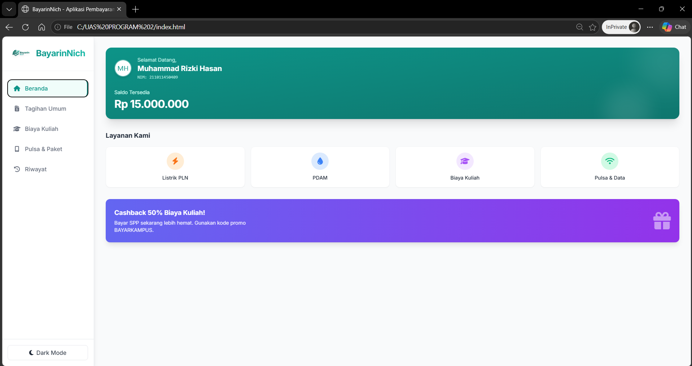
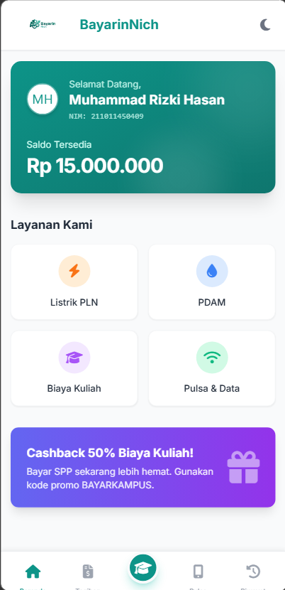

# BayarinNich - Aplikasi Pembayaran Tagihan & Top-Up Multi-Layanan

**BayarinNich** adalah aplikasi web frontend interaktif (Single Page Application - SPA) yang dirancang untuk mensimulasikan proses pembayaran berbagai tagihan rutin masyarakat Indonesia serta pengisian pulsa/paket data. Aplikasi ini berjalan sepenuhnya di sisi klien (*client-side*) tanpa memerlukan server nyata, dengan memanfaatkan *state management* berbasis JavaScript Object dan penyimpanan lokal browser (*LocalStorage*).

Proyek ini dibangun untuk memenuhi tugas kuliah pemrograman frontend dengan fokus optimalisasi tampilan pada **Desktop** (NIM Ganjil), namun tetap mendukung tampilan responsif untuk perangkat **Mobile**.

---

## 👤 Detail Mahasiswa
- **Nama Lengkap:** Muhammad Rizki Hasan
- **NIM:** 211011450409
- **Fokus Desain:** Desktop View Optimization (NIM Ganjil)

---

## 🚀 Cara Menjalankan Aplikasi
Aplikasi ini dibangun menggunakan teknologi web standar (Vanilla HTML, CSS, & JavaScript) tanpa memerlukan proses *build* atau instalasi *dependency*.

1. Unduh atau salin seluruh isi direktori proyek ini.
2. Navigasikan ke dalam folder proyek.
3. Klik ganda atau buka file **`index.html`** menggunakan peramban web modern pilihan Anda (Google Chrome, Mozilla Firefox, Microsoft Edge, Safari, dll).
4. Aplikasi siap digunakan!

---

## 🛠️ Fitur Utama & Pendukung yang Diimplementasikan
Berikut adalah daftar fitur lengkap yang telah berhasil diimplementasikan:

### 1. Halaman Dashboard (SPA style)
- **Ringkasan Saldo Simulasi:** Menampilkan saldo aktif pengguna yang tersimpan di *LocalStorage*.
- **Quick Access Kategori Layanan:** Tombol akses cepat ke Listrik PLN, PDAM, Biaya Kuliah, dan Pulsa/Data.
- **Profil User Dinamis:** Menampilkan Nama Lengkap dan NIM mahasiswa secara dinamis pada kartu profil utama.
- **Banner Promosi:** Informasi penawaran spesial dan kode promo yang relevan secara visual.

### 2. Pembayaran Tagihan Umum (Listrik, PDAM, Internet)
- **Input ID Pelanggan Fleksibel:** Mendukung input ID khusus (seperti PLN, PDAM, Internet) dengan validasi format angka.
- **Simulasi Tagihan Bebas (Dummy Generator):** Jika ID Pelanggan tidak terdaftar di data internal, sistem akan secara otomatis membuat tagihan simulasi secara acak agar memudahkan demonstrasi visual.
- **Pengecekan Realistis:** Simulasi pemanggilan API menggunakan efek *loading spinner* (delay 1-1.8 detik).

### 3. Pembayaran Khusus (Cicilan Kuliah / SPP)
- **Input NIM Siswa:** Pengecekan status tagihan berdasarkan NIM Anda (**`211011450409`**).
- **Multi-Selection Checkbox:** Mahasiswa dapat memilih lebih dari satu cicilan aktif (masing-masing senilai Rp 500.000) untuk dibayarkan secara bersamaan. Total tagihan akan terhitung secara otomatis dan dinamis di bagian bawah.

### 4. Isi Pulsa & Paket Data
- **Deteksi Provider Otomatis:** Sistem membaca prefiks nomor HP yang dimasukkan (misalnya `0812` -> Telkomsel, `0857` -> Indosat) dan menampilkan logo operator secara *real-time*.
- **Pilihan Nominal Pulsa:** Grid pilihan nominal pulsa mulai dari Rp10.000 hingga Rp200.000 lengkap beserta rincian harga simulasinya.

### 5. Alur Pembayaran & Konfirmasi (Modal Window)
- **Metode Pembayaran Lengkap:**
  - **Virtual Account (VA):** Simulasi nomor VA unik + panduan pembayaran bank.
  - **QRIS:** Generator kode QR dinamis menggunakan *qrcode.js* + *countdown timer* 5 menit.
  - **Teller / Kasir:** Kode pembayaran unik untuk ditunjukkan di minimarket terdekat.
- **Tombol Cek Status Pembayaran:** Simulasi verifikasi instan status transaksi pembayaran.
- **Pop-up Bukti Transaksi (Cetak Struk):** Membuka struk thermal di tab baru dengan integrasi print bawaan browser (*Save as PDF* / *Cetak Printer*) yang menampilkan Logo BayarinNich, detail transaksi, Nama Mahasiswa, dan NIM Anda.

### 6. Riwayat Transaksi (History)
- **State Persistence:** Semua transaksi sukses tercatat di `localStorage` dan tidak hilang meski browser dimuat ulang.
- **Unduh/Cetak Ulang Struk:** Tombol cetak pada tabel riwayat untuk memunculkan kembali struk transaksi yang telah berlalu.
- **Clear History:** Tombol untuk membersihkan semua data riwayat dari `localStorage`.

### 7. Fitur Tambahan (Aesthetic & UX)
- **Dark / Light Mode Toggle:** Tombol peralihan tema gelap dan terang secara global yang konsisten.
- **Toast Notifications:** Pemberitahuan pop-up dinamis untuk sukses, error, atau info.
- **Logo Transparan Kustom:** Integrasi penuh logo *brand* `logo-bayarinnich.png`.

---

## 📸 Screenshots

### Desktop Layout (Sidebar Navigation)
Berikut adalah tampilan antarmuka optimal untuk layar Desktop:

### Mobile Layout (Bottom Tab Navigation)
Berikut adalah tampilan antarmuka optimal untuk layar Mobile:

---

## 🌐 Link Demo Aplikasi
Aplikasi dapat diakses secara langsung melalui tautan berikut jika telah di-deploy:
- **Netlify :** `bayarinnich.netlify.app`
- **Video Tutorial Penggunaan (YouTube):** `[Tautan Video Demo Maksimal 5 Menit]`
